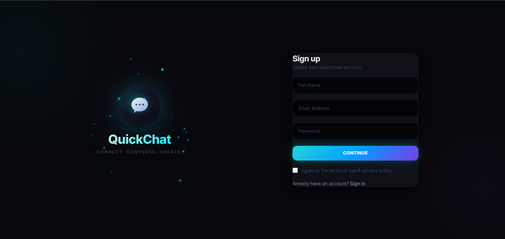
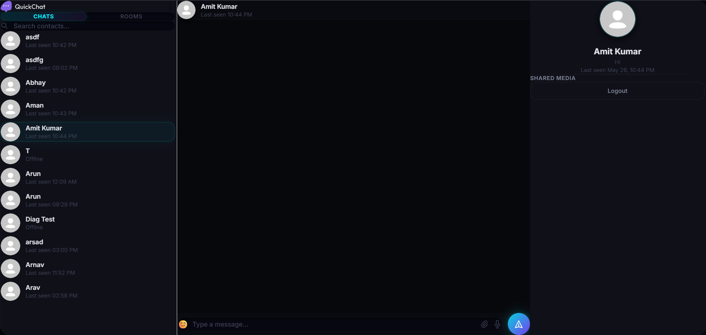
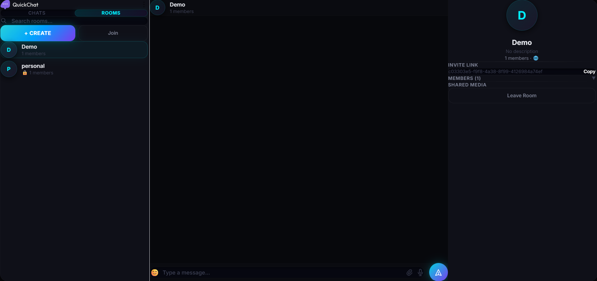
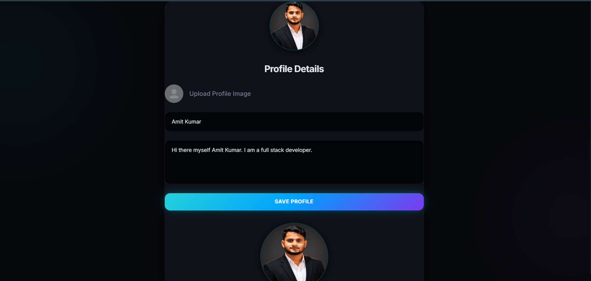

<div align="center">

<br/>

```
 ██████╗ ██╗   ██╗██╗ ██████╗██╗  ██╗ ██████╗██╗  ██╗ █████╗ ████████╗
██╔═══██╗██║   ██║██║██╔════╝██║ ██╔╝██╔════╝██║  ██║██╔══██╗╚══██╔══╝
██║   ██║██║   ██║██║██║     █████╔╝ ██║     ███████║███████║   ██║   
██║▄▄ ██║██║   ██║██║██║     ██╔═██╗ ██║     ██╔══██║██╔══██║   ██║   
╚██████╔╝╚██████╔╝██║╚██████╗██║  ██╗╚██████╗██║  ██║██║  ██║   ██║   
 ╚══▀▀═╝  ╚═════╝ ╚═╝ ╚═════╝╚═╝  ╚═╝ ╚═════╝╚═╝  ╚═╝╚═╝  ╚═╝   ╚═╝  
```

### ⚡ Premium Real-Time Chat — Instant. Secure. Beautiful.

<br/>

[](https://chat-app-client-wheat-three.vercel.app/)
&nbsp;
[](https://react.dev)
&nbsp;
[](https://nodejs.org)
&nbsp;
[](https://socket.io)
&nbsp;
[](https://mongodb.com)

<br/>

[](https://vercel.com)
&nbsp;
[](https://render.com)
&nbsp;
[](https://redis.io)
&nbsp;
[](https://cloudinary.com)
&nbsp;
[](https://jwt.io)

<br/>

[](https://opensource.org/licenses/MIT)
&nbsp;
[](http://makeapullrequest.com)
&nbsp;
[](https://github.com/AmitK241)

<br/>

> *"Connect instantly. Chat beautifully. Feel the speed."*

<br/>

</div>

---

## 📖 Table of Contents

- [✨ About](#-about)
- [🎯 Features](#-features)
- [🛠️ Tech Stack](#️-tech-stack)
- [🏗️ Architecture](#️-architecture)
- [📁 Project Structure](#-project-structure)
- [⚙️ Installation](#️-installation)
- [🔧 Environment Variables](#-environment-variables)
- [▶️ Running the App](#️-running-the-app)
- [🌍 Live Demo](#-live-demo)
- [📸 Screenshots](#-screenshots)
- [🤝 Contributing](#-contributing)
- [📜 License](#-license)
- [👨‍💻 Author](#-author)

---

## ✨ About

**QuickChat** is a full-stack, production-ready real-time messaging platform built with the **MERN stack** and **Socket.IO**. It delivers a lightning-fast, seamless chat experience with features like private messaging, group chat rooms, live typing indicators, online presence tracking, and profile avatars via Cloudinary — all wrapped in a sleek, modern UI powered by **React 19**, **Tailwind CSS v4**, and **Framer Motion** animations.

Built to be deployed at scale — the backend runs on **Render** with **Redis** for socket state, while the frontend is deployed on **Vercel** for edge-optimized delivery.

---

## 🎯 Features

<table>
  <thead>
    <tr>
      <th>Category</th>
      <th>Feature</th>
      <th>Details</th>
    </tr>
  </thead>
  <tbody>
    <tr>
      <td rowspan="3">💬 <strong>Messaging</strong></td>
      <td>⚡ Real-Time Messaging</td>
      <td>Bi-directional WebSocket communication via Socket.IO</td>
    </tr>
    <tr>
      <td>⌨️ Typing Indicators</td>
      <td>Live "is typing..." feedback for active conversations</td>
    </tr>
    <tr>
      <td>🖼️ Media Messages</td>
      <td>Send and receive images via Cloudinary CDN</td>
    </tr>
    <tr>
      <td rowspan="2">🏠 <strong>Rooms</strong></td>
      <td>🆕 Create Rooms</td>
      <td>Spin up private or public group chat rooms instantly</td>
    </tr>
    <tr>
      <td>🔑 Join Rooms</td>
      <td>Join existing rooms with a room code or ID</td>
    </tr>
    <tr>
      <td rowspan="3">🔐 <strong>Auth & Users</strong></td>
      <td>🔐 JWT Authentication</td>
      <td>Secure stateless auth with HTTP-only cookies</td>
    </tr>
    <tr>
      <td>🟢 Online Status</td>
      <td>Real-time presence — see who's online right now</td>
    </tr>
    <tr>
      <td>👤 Profile Management</td>
      <td>Update avatar and profile info with Cloudinary upload</td>
    </tr>
    <tr>
      <td rowspan="2">🎨 <strong>UI/UX</strong></td>
      <td>📱 Fully Responsive</td>
      <td>Seamless experience on mobile, tablet, and desktop</td>
    </tr>
    <tr>
      <td>✨ Smooth Animations</td>
      <td>Polished transitions powered by Framer Motion</td>
    </tr>
    <tr>
      <td rowspan="2">☁️ <strong>Infrastructure</strong></td>
      <td>🗄️ Redis Presence Layer</td>
      <td>Scalable online tracking with Redis (falls back to in-memory)</td>
    </tr>
    <tr>
      <td>🌐 Cloud Deployed</td>
      <td>Frontend → Vercel | Backend → Render</td>
    </tr>
  </tbody>
</table>

---

## 🛠️ Tech Stack

<div align="center">

| Layer | Technology | Purpose |
|---|---|---|
| **Frontend** | React 19 + Vite 7 | SPA framework with lightning-fast HMR |
| **Styling** | Tailwind CSS v4 | Utility-first, zero-config CSS |
| **Animations** | Framer Motion 12 | Declarative UI animations & transitions |
| **Routing** | React Router DOM v7 | Client-side navigation |
| **Real-Time (Client)** | Socket.IO Client v4 | WebSocket + fallback transport |
| **HTTP Client** | Axios | Promise-based API requests |
| **Notifications** | React Hot Toast | Sleek in-app toast messages |
| **Backend** | Node.js + Express 5 | REST API & WebSocket server |
| **Real-Time (Server)** | Socket.IO Server v4 | Event-driven socket management |
| **Database** | MongoDB + Mongoose 9 | NoSQL document storage |
| **Cache / Presence** | Redis (ioredis) | Online user tracking & pub/sub |
| **Auth** | JWT + bcryptjs | Secure token-based auth with password hashing |
| **Media Storage** | Cloudinary | Cloud image upload & delivery |
| **Frontend Deploy** | Vercel | Edge CDN, global deployment |
| **Backend Deploy** | Render | Persistent server + auto-scaling |

</div>

---

## 🏗️ Architecture

```
┌─────────────────────────────────────────────────────────────────────┐
│                         CLIENT (Vercel CDN)                         │
│  ┌──────────┐  ┌───────────────┐  ┌──────────────┐  ┌──────────┐  │
│  │  React   │  │  Tailwind CSS │  │ Framer Motion│  │ Axios /  │  │
│  │  19 SPA  │  │    v4 UI      │  │  Animations  │  │Socket.IO │  │
│  └────┬─────┘  └───────────────┘  └──────────────┘  └────┬─────┘  │
└───────┼────────────────────────────────────────────────────┼────────┘
        │  HTTPS REST                                        │ WSS
        ▼                                                    ▼
┌─────────────────────────────────────────────────────────────────────┐
│                       SERVER (Render.com)                           │
│  ┌──────────────────────────────────────────────────────────────┐   │
│  │                    Express.js + Socket.IO                    │   │
│  │  ┌────────────┐  ┌──────────────┐  ┌─────────────────────┐  │   │
│  │  │ Auth Routes│  │Message Routes│  │    Room Routes      │  │   │
│  │  │ /api/auth  │  │/api/messages │  │    /api/rooms       │  │   │
│  │  └────────────┘  └──────────────┘  └─────────────────────┘  │   │
│  │  ┌────────────────────────────────────────────────────────┐  │   │
│  │  │                   Socket Service                       │  │   │
│  │  │   join_room · send_message · typing · online presence  │  │   │
│  │  └────────────────────────────────────────────────────────┘  │   │
│  └──────────────────────────────────────────────────────────────┘   │
│            │                                   │                    │
│            ▼                                   ▼                    │
│  ┌─────────────────┐                 ┌──────────────────┐           │
│  │    MongoDB      │                 │   Redis (ioredis)│           │
│  │  Users, Rooms,  │                 │  Online Presence │           │
│  │   Messages      │                 │    & Pub/Sub     │           │
│  └─────────────────┘                 └──────────────────┘           │
│                                                                      │
│  ┌──────────────────────────────────────────────────────────────┐   │
│  │              Cloudinary  (Image Storage & CDN)               │   │
│  └──────────────────────────────────────────────────────────────┘   │
└─────────────────────────────────────────────────────────────────────┘
```

---

## 📁 Project Structure

```
quickchat/
│
├── 📁 client/                        # Frontend (React + Vite)
│   ├── 📁 src/
│   │   ├── 📁 components/            # Reusable UI components
│   │   │   ├── ChatContainer.jsx     # Main chat window & message list
│   │   │   ├── Sidebar.jsx           # User/room list sidebar
│   │   │   ├── RightSidebar.jsx      # User profile & room info panel
│   │   │   ├── CreateRoomModal.jsx   # Modal to create a new room
│   │   │   ├── JoinRoomModal.jsx     # Modal to join an existing room
│   │   │   └── TypingIndicator.jsx   # Animated "typing..." dots
│   │   ├── 📁 pages/
│   │   │   ├── HomePage.jsx          # Main chat page (protected)
│   │   │   ├── LoginPage.jsx         # Sign in / Sign up page
│   │   │   └── ProfilePage.jsx       # Edit profile & avatar
│   │   ├── 📁 context/               # React Context providers
│   │   ├── 📁 lib/                   # Utility helpers
│   │   ├── App.jsx                   # Root component & routing
│   │   ├── main.jsx                  # React entry point
│   │   └── index.css                 # Global styles
│   ├── index.html
│   ├── vite.config.js
│   └── package.json
│
├── 📁 server/                        # Backend (Node.js + Express)
│   ├── 📁 controllers/               # Route handler logic
│   ├── 📁 routes/                    # API route definitions
│   │   ├── userRoutes.js             # /api/auth — register, login, logout
│   │   ├── messageRoutes.js          # /api/messages — CRUD messages
│   │   └── roomRoutes.js             # /api/rooms — room management
│   ├── 📁 models/                    # Mongoose schemas
│   │   ├── User.js                   # User model
│   │   ├── Message.js                # Message model
│   │   └── Room.js                   # Room model
│   ├── 📁 middleware/                # Auth & validation middleware
│   ├── 📁 services/
│   │   └── socketService.js          # All Socket.IO event handlers
│   ├── 📁 lib/
│   │   ├── db.js                     # MongoDB connection
│   │   └── redis.js                  # Redis connection with fallback
│   ├── server.js                     # App entry point
│   ├── .env.example                  # Environment variable template
│   └── package.json
│
├── render.yaml                       # Render deployment config
└── README.md
```

---

## ⚙️ Installation

### Prerequisites

Make sure you have the following installed:

- **Node.js** `>= 18.x` — [Download](https://nodejs.org/)
- **npm** `>= 9.x` (comes with Node.js)
- **MongoDB** — [MongoDB Atlas](https://www.mongodb.com/cloud/atlas) (free tier works great)
- **Redis** — [Upstash Redis](https://upstash.com/) (optional, falls back to in-memory)
- **Cloudinary** — [Free account](https://cloudinary.com/) for image uploads

---

### 1️⃣ Clone the Repository

```bash
git clone https://github.com/Ashish200402/Chat-App.git
cd Chat-App
```

---

### 2️⃣ Install Dependencies

```bash
# Install backend dependencies
cd server
npm install

# Install frontend dependencies
cd ../client
npm install
```

---

## 🔧 Environment Variables

### Backend — `server/.env`

Copy `server/.env.example` and fill in your values:

```bash
cp server/.env.example server/.env
```

```env
# Server
PORT=5000

# Database
MONGODB_URI=mongodb+srv://<user>:<password>@cluster0.xxxxx.mongodb.net/chatapp

# Auth
JWT_SECRET=your_super_secret_jwt_key_here

# CORS
CLIENT_URL=http://localhost:5173

# Cloudinary (for image uploads)
CLOUDINARY_CLOUD_NAME=your_cloud_name
CLOUDINARY_API_KEY=your_api_key
CLOUDINARY_API_SECRET=your_api_secret
```

### Frontend — `client/.env`

```env
VITE_SERVER_URL=http://localhost:5000
```

---

## ▶️ Running the App

### Start Backend (Terminal 1)

```bash
cd server
npm run server       # development (nodemon — auto-restarts on changes)
# or
npm start            # production
```

> ✅ Server starts on `http://localhost:5000`

### Start Frontend (Terminal 2)

```bash
cd client
npm run dev
```

> ✅ App opens at `http://localhost:5173`

---

## 🌍 Live Demo

<div align="center">

### 🚀 **[Try QuickChat Live →](https://chat-app-client-wheat-three.vercel.app/)**

| Service | URL |
|---|---|
| 🌐 Frontend | [chat-app-client-wheat-three.vercel.app](https://chat-app-client-wheat-three.vercel.app/) |
| 🔗 Backend API | [Render — Auto-deployed](https://render.com) |
| 📊 Health Check | `/api/health` |

</div>

---

## 📸 Screenshots

<table>
  <tr>
    <td>Sign Up</td>
    <td>Chats</td>
  </tr>
  <tr>
    <td>Rooms</td>
    <td>Profile</td>
  </tr>
</table>

---

## 🔌 API Endpoints

<details>
<summary><strong>Auth Routes — <code>/api/auth</code></strong></summary>

| Method | Endpoint | Description | Auth Required |
|--------|----------|-------------|:---:|
| `POST` | `/api/auth/register` | Register a new user | ❌ |
| `POST` | `/api/auth/login` | Login & receive JWT | ❌ |
| `POST` | `/api/auth/logout` | Logout & clear cookie | ✅ |
| `GET` | `/api/auth/me` | Get current user profile | ✅ |
| `PUT` | `/api/auth/profile` | Update profile & avatar | ✅ |

</details>

<details>
<summary><strong>Message Routes — <code>/api/messages</code></strong></summary>

| Method | Endpoint | Description | Auth Required |
|--------|----------|-------------|:---:|
| `GET` | `/api/messages/:id` | Fetch messages for a conversation | ✅ |
| `POST` | `/api/messages/send/:id` | Send a new message | ✅ |

</details>

<details>
<summary><strong>Room Routes — <code>/api/rooms</code></strong></summary>

| Method | Endpoint | Description | Auth Required |
|--------|----------|-------------|:---:|
| `POST` | `/api/rooms/create` | Create a new room | ✅ |
| `POST` | `/api/rooms/join` | Join an existing room | ✅ |
| `GET` | `/api/rooms` | List all joined rooms | ✅ |

</details>

<details>
<summary><strong>Socket Events</strong></summary>

| Event | Direction | Description |
|-------|-----------|-------------|
| `join_room` | Client → Server | Join a specific room |
| `send_message` | Client → Server | Emit a new message |
| `receive_message` | Server → Client | Receive an incoming message |
| `typing` | Client → Server | Notify typing start |
| `stop_typing` | Client → Server | Notify typing stop |
| `getOnlineUsers` | Server → Client | Broadcast online user list |
| `disconnect` | Client → Server | Handle user disconnection |

</details>

---

## 🤝 Contributing

Contributions are always welcome! Here's how to get started:

```bash
# 1. Fork the repository on GitHub

# 2. Clone your fork
git clone https://github.com/YOUR_USERNAME/Chat-App.git

# 3. Create a feature branch
git checkout -b feature/your-amazing-feature

# 4. Make your changes and commit
git add .
git commit -m "✨ feat: add your amazing feature"

# 5. Push to your fork
git push origin feature/your-amazing-feature

# 6. Open a Pull Request on GitHub 🚀
```

**Commit message convention:**

| Prefix | When to use |
|--------|-------------|
| `✨ feat:` | New feature |
| `🐛 fix:` | Bug fix |
| `💄 style:` | UI/style changes |
| `♻️ refactor:` | Code refactoring |
| `📝 docs:` | Documentation |
| `🚀 deploy:` | Deployment changes |

---

## 📜 License

This project is licensed under the **MIT License** — see the [LICENSE](LICENSE) file for details.

```
MIT License — free to use, modify, and distribute with attribution.
```

---

## 👨‍💻 Author

<div align="center">

### Ashish Gupta


*Full-Stack Developer | MERN Stack | Real-Time Systems*

</div>

---

<div align="center">

### ⭐ Found this useful? Drop a star — it means a lot!

<br/>

```
  ██████╗ ██╗   ██╗██╗ ██████╗██╗  ██╗ ██████╗██╗  ██╗ █████╗ ████████╗
  ██╔══██╗██║   ██║██║██╔════╝██║ ██╔╝██╔════╝██║  ██║██╔══██╗╚══██╔══╝
  ██║  ██║██║   ██║██║██║     █████╔╝ ██║     ███████║███████║   ██║   
  ██║  ██║██║   ██║██║██║     ██╔═██╗ ██║     ██╔══██║██╔══██║   ██║   
  ██████╔╝╚██████╔╝██║╚██████╗██║  ██╗╚██████╗██║  ██║██║  ██║   ██║   
  ╚═════╝  ╚═════╝ ╚═╝ ╚═════╝╚═╝  ╚═╝ ╚═════╝╚═╝  ╚═╝╚═╝  ╚═╝   ╚═╝  
```

*Built with ☕, late-night debugging sessions, and way too many `console.log()` calls.*

<br/>

**[🚀 Try the Live Demo](https://chat-app-client-wheat-three.vercel.app/)

</div>
